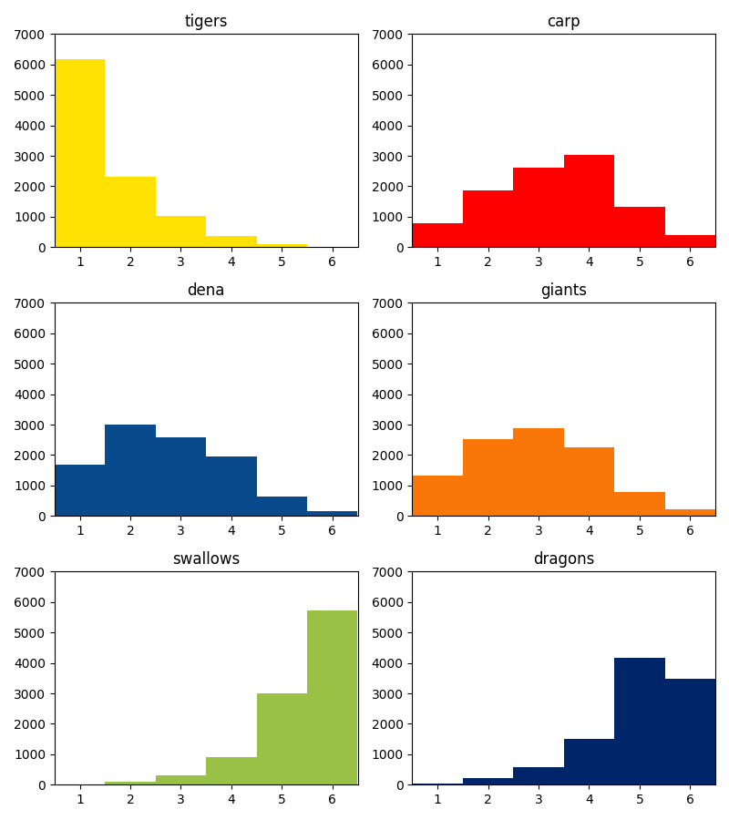
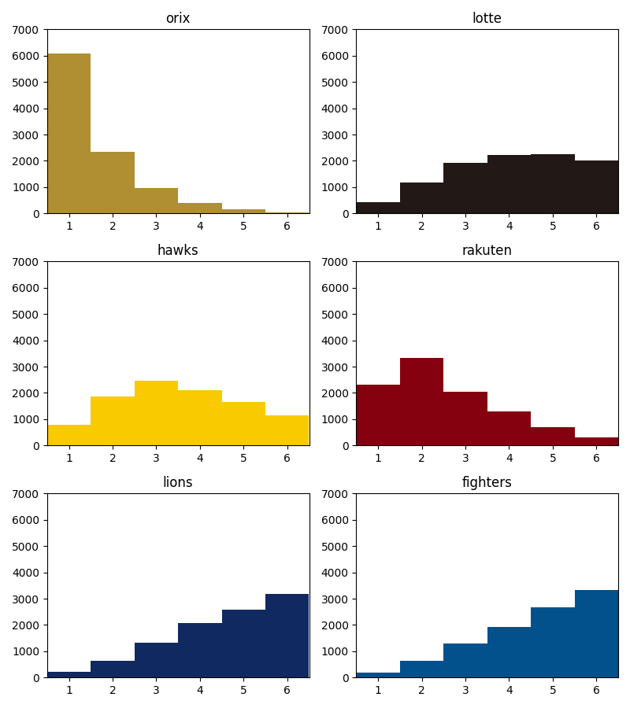

プロ野球シーズンシミュレーター
===

## Usage

- Docker

```shell
make docker-run
```

- Local

```shell
make poetry-install   # 初回のみ
make local-run
```

## コメント

### Games Class
大雑把にいうと、交流戦を外した125試合について、対戦先発投手をなるべく均等にするように新しいスケジュールを作っています。

### Runs

AチームのB投手 vs CチームのD投手のように先発投手がそれぞれ決まった際に、両チームの獲得点数を算出します。野球は自チームの攻撃と守備が完全に独立しているので、考慮すべきは、`（自チームの獲得点数）＝（自チームの攻撃力の影響度）+（相手チームの守備力の影響度）`になりますが、ここでは大雑把に以下のように点数を算出します。

- 方法①：自チームの獲得点数　<-　自チームの先発投手と対戦チームとの過去実績点数からランダムに1つ選択
- 方法②：自チームの獲得点数　<-　自チームの先発投手と他5チームとの過去実績点数からランダムに1つ選択（Aより範囲広め）
- 方法③：自チームの獲得点数　<-　自チームの125試合の獲得点数からランダムに1つ選択
- 上記3つの方法のうち、方法①をメインにしつつ②や③も適度に考慮

本来はリリーフ投手の出来や、対戦打者のその日のメンバーなででも結果は動くはずですが、ここではあえて簡略化するために点数のブレを先発投手に限定しています。

また、2年前にシミュレーションをした際は、基本的に方法①の方法を採用しつつ、投手BとチームCの対戦成績がない場合チームAとチームCの対戦成績からランダムにチョイスする。みたいな方法を採用していましたが、以下の方法で問題があるかなと思いました。

- どんな好投手でもたまに炎上する。シーズン中Cチームとの対戦が1度しかなく、たまたまその1回炎上してしまうと、その投手がどれだけ他のチームを抑えていたとしても、どうしても炎上時の点数がシミュレーションに反映されてしまい、ブレが大きくなる。
- チームAとチームCの対戦成績からランダムにチョイスするっていうのが感覚的におかしい気がする。

そこで今回は手法を改めた次第です。なお、方法①をメインにしつつ、それ以外の2つについては、頻度的に 方法② > 方法③ で採用しています。これは数字の根拠をとったわけではありませんが、感覚的にチームの打力よりも先発投手の能力に得点が左右されるケースが思うからです。

### Simulation

シミュレーション自体は、先ほどまでクラスを使ってあとは淡々とやるだけです。2年前と違ってnumbaを使っています。そのおかげでだいぶ高速化できました。

## 結果

- 結果（順位）のヒストグラムは以下のようになりました
- 色々ロジックをいじってどうなるかみてみると面白いと思います

| セントラルリーグ | パシフィックリーグ |
| -- | -- |
|  |  |
